# final_pjt

## 팀 소개

안녕하세요, 구미 파이썬 Track 이수자인 변윤경, 양서정 교육생입니다. 

저희는 이번 5회차 월말평가인 관통 PJT에서 "MBTI기반 영화 추천 사이트"를 제작하게 되었습니다. 최근 한국에서 MBTI 열풍이 일어난 만큼 대중들은 MBTI에 관심이 많은데요,  이러한 점을 고려해서 'MBTI기반 영화 추천 사이트'를 제작하게 되었습니다. 기존 영화 사이트에 영화와 관련된 성격 유형 검사를 하고, 그 결과에 맞춰 추천 영화와 여러가지 서비스를 제공하는 사이트입니다. 


## 업무 분담

### 변윤경

- Django의 Model생성 및 serializer, view 구현
- Vue의 store 및 router구성
- Vue의 view 및 component의 상속 관계 및 기능 구현

### 양서정

- mbti 유형 검사
- mbti 별 추천


## 목표 서비스 구현 및 실제 구현 정도

실제 구현

- 영화 세부사항 페이지
- mbti 검사
- mbti를 활용한 영화 추천 알고리즘
- 다중 장르 선택을 통한 영화 추천 알고리즘
- 영화 리뷰기능
- 영화 정렬 기능


- 마이페이지
- 영화 좋아요 기능

## ERD

### Models

- Genre

  ```python
  class Genre(models.Model):
      id = models.IntegerField(primary_key=True)
      name = models.CharField(max_length=50)
  
      def __str__(self) : 
          return self.name
  
  ```

- Movie

  ```python
  class Movie(models.Model) :
      id = models.IntegerField(primary_key=True)
      genres = models.ManyToManyField(Genre)
  
      title = models.CharField(max_length=100)
      release_date = models.DateField()
      popularity = models.FloatField()
      vote_average = models.FloatField()
      vote_count = models.IntegerField()
      overview = models.TextField()
      poster_path = models.CharField(max_length=200)
      backdrop_path = models.CharField(max_length=200)
      
      def __str__(self):
          return self.title
  ```

- Comment

  ```python
  class Comment(models.Model):
      user = models.ForeignKey(settings.AUTH_USER_MODEL, on_delete=models.CASCADE)
      movie = models.ForeignKey(Movie, on_delete=models.CASCADE)
      content = models.TextField()
      created_at = models.DateTimeField(auto_now_add=True)
  
      def username(self):
          return self.user.username
  ```

- Mbti

  ```python
  class Mbti(models.Model):
      title = models.TextField()
      type = models.TextField()
      choice1 = models.TextField()
      choice2 = models.TextField()
      picture1 = models.TextField()
      picture2 = models.TextField()
  ```

- Detail

  ```python
  class Detail(models.Model):
      type = models.TextField(unique=True)
      title = models.TextField()
      sub_title = models.TextField()
      char = models.TextField()
      genres = models.TextField()
      img = models.TextField()
  ```

  


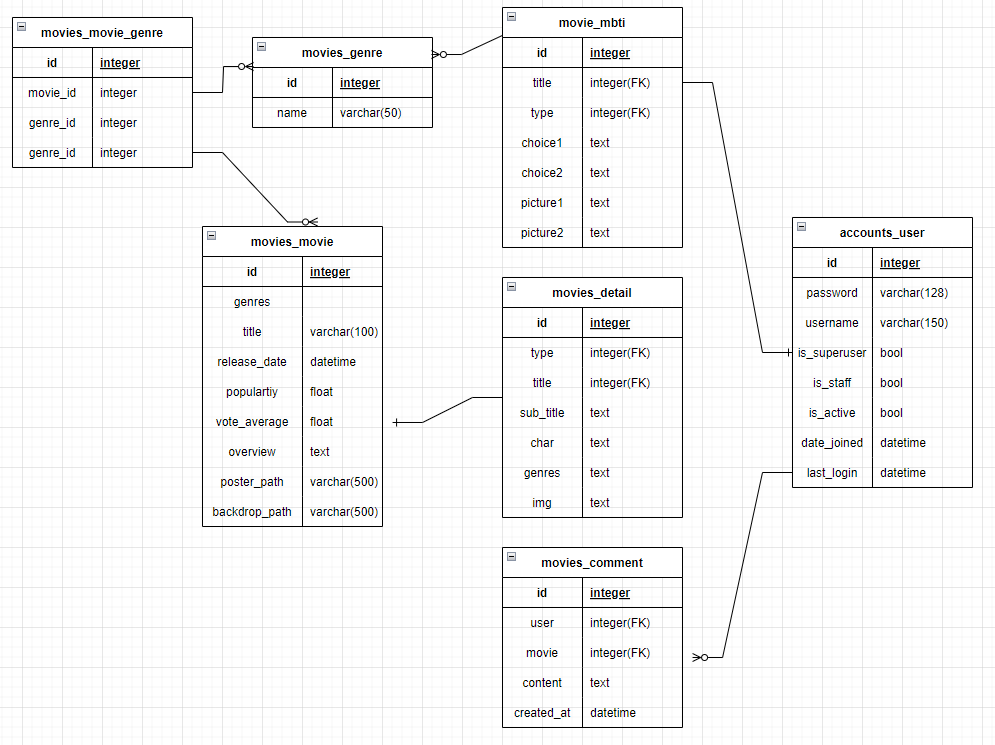


## 영화 추천 알고리즘

### 1. MBTI 검사를 통한 영화 추천 알고리즘

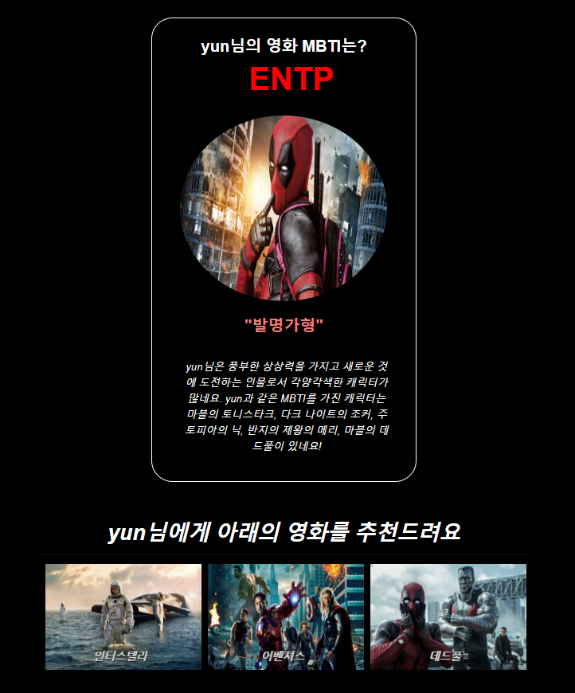


#### 알고리즘 Detail

- 버튼 클릭시 findType 함수 호출

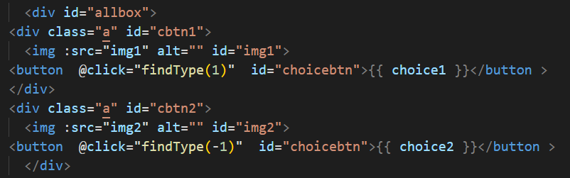

- 반복문을 통해 12개의 질문에서  -와 +로 EI, NS, FT, JP의 값 계산
  - 예를 들어 
    - E에 관련된 질문을 선택하면 `EI += 1`
    - I에 관련된 질문을 선택하면 `EI -= 1`

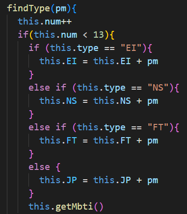

- `getMbti`메소드로 Django에 axios를 호출하여  Mbti 결과 산출

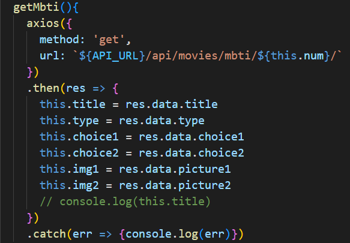

```json
{ "pk": 1,
    "model": "movies.detail",
    "fields": {
        "type": "ISTJ",
        "title" :  "진지한 모범생형",
        "sub_title" : "사무적, 실용적, 현실도모적인 일을 많이 하는 유형으로서 등장인물들에게 인정받는 역할인 경우가 많습니다.",
        "char" : "마블의 가모라, 해리 포터의 퍼시 위즐리, 반지의 제왕에 보로미르, 킹스맨의 해리가 있네요!",
        "genres" : "역사와 사극 장르",
        "img" : "https://p4.wallpaperbetter.com/wallpaper/912/246/383/zoe-saldana-as-gamora-in-avengers-infinity-war-4k-8k-wallpaper-preview.jpg"
      }
  },
```


- getResult 메서드를 통해 MBTI 조합별 장르 리스트 계산

  ```python
   getResult(){
      if(this.EI > 0){
        this.result = this.result + "E"
        this.genres.push(12, 28) // 모험, 액션
      }
      else{
        this.result = this.result + "I"
        this.genres.push(16, 10751)
      }
      if(this.NS > 0){
        this.result = this.result + "N"
        this.genres.push(14, 10752)
      }
      else{
        this.result = this.result + "S"
        this.genres.push(36, 37, 99)
      }
      if(this.FT > 0){
        this.result = this.result + "F"
        this.genres.push(18, 10402, 10749)
      }
      else{
        this.result = this.result + "T"
        this.genres.push(27, 53)
      }
      if(this.JP > 0){
        this.result = this.result + "J"
        this.genres.push(80, 9648)
      }
      else{
        this.result = this.result + "P"
        this.genres.push(35, 10770)
      }
  ```

  

### 2. 다중 장르 선택 영화 추천 알고리즘

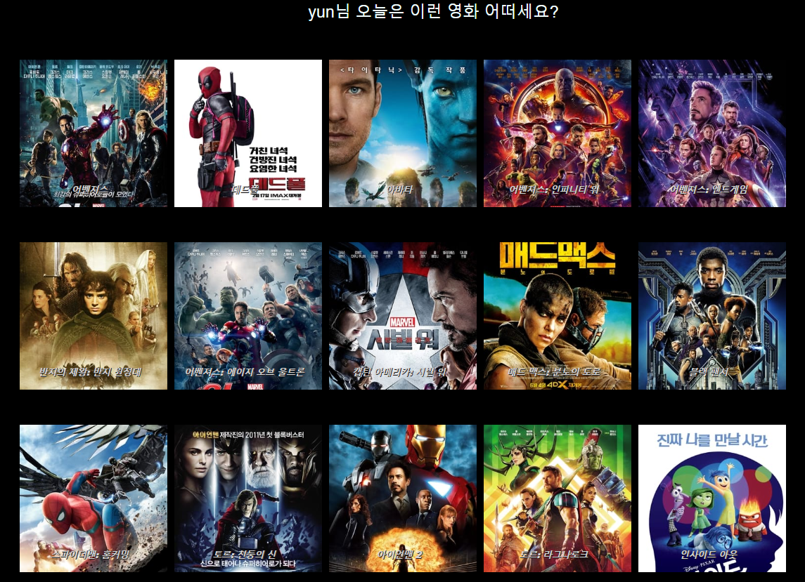

#### 알고리즘 Detail

- 리스트로 값 받아 저장하기

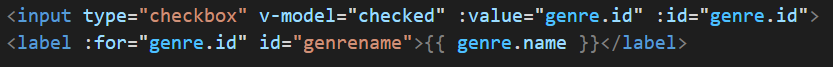

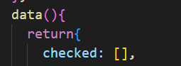

- `getRecommend` 메서드로 Django에 axios호출하기

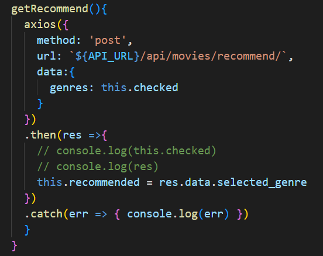


- Django에서 선택한 장르에 속하는 영화들 중 평점이 높은 순으로 추출하여 반환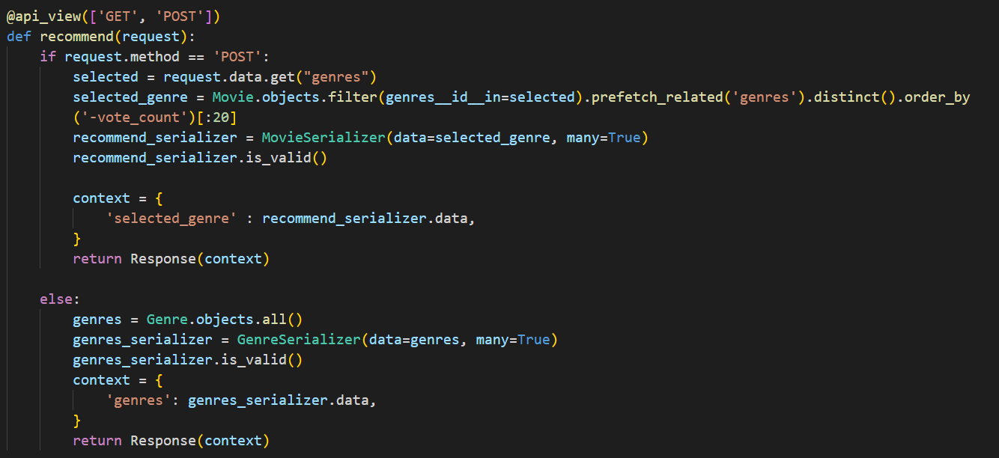


## 서비스 대표 기능

### 1. MBTI 성향 검사

#### 1-1. 12가지 질문을 통한 MBTI 성향 검사

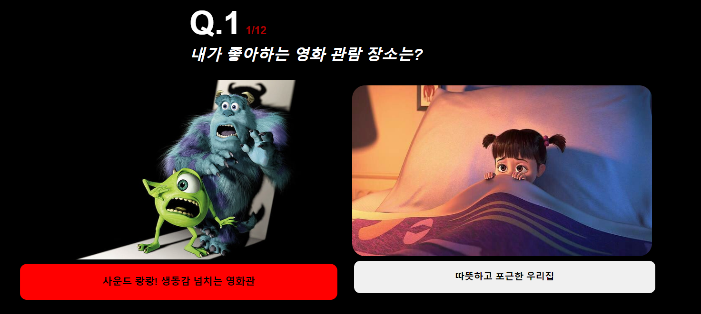

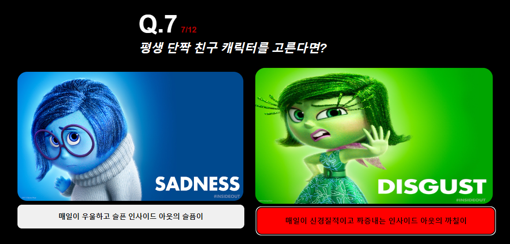

#### 1-2 MBTI 검사 결과

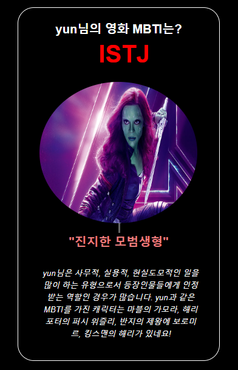

#### 1-3. MBTI 별 영화 추천


### 영화 감상평

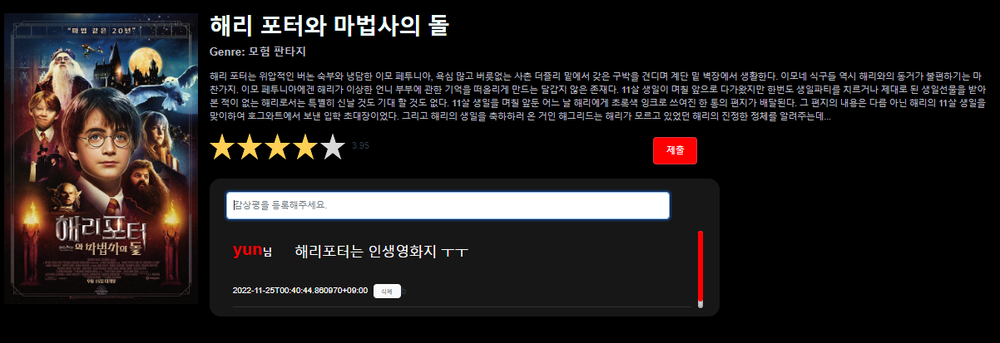


### 선택한 영화와 비슷한 장르의 영화 추천

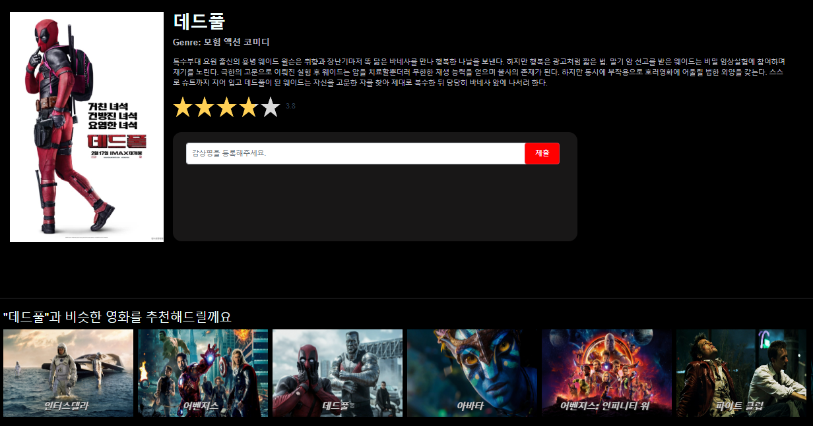


## 느낀점

### 변윤경

한학기 동안 배운 내용을 이번 프로젝트 동안 다 사용해 볼 수 있어서 복습하는데 큰 도움이 되었습니다.

그리고 배운 내용을 그대로 사용하는 능력 뿐만 아니라 새로운 기능을 구글링해서 찾아내고 적용하는 것도 개발에 중요한 역량이라는 것을 깨달았습니다.

### 양서정

이번 한 학기동안 가장 열심히 달려온 한주였습니다. 싸피에 들어와서 난생 처음 배우는 장고와 뷰, CSS 등을 이용해 한 학기를 마무리 하는데에 있어서 많이 부족함도 느끼고 한 층 더 성장할 수 있던 좋은 기회였습니다. 프로젝트를 수행하면서 어려운 상황에 부딪치고 해결하는 과정에서 실력이 많이 늘었다고 생각합니다. 처음 도전해본 웹 사이트 개발이니만큼 아쉬움과 뿌듯함이 공존하는 것 같습니다.